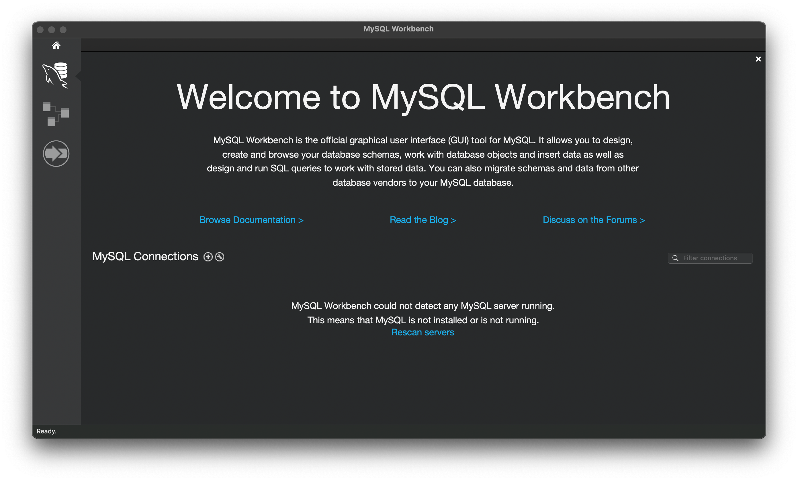
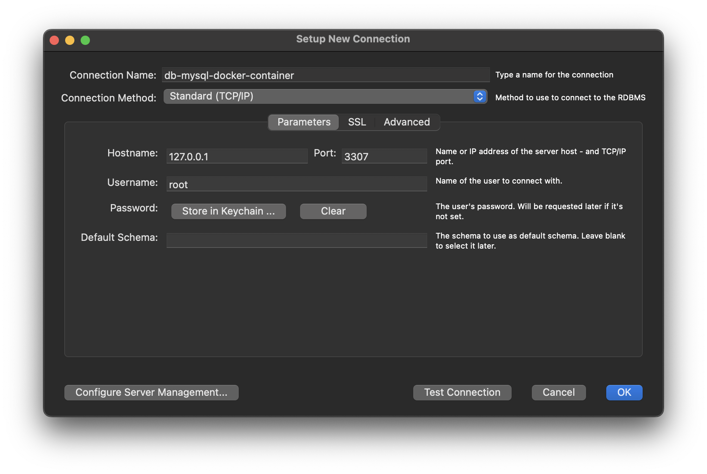
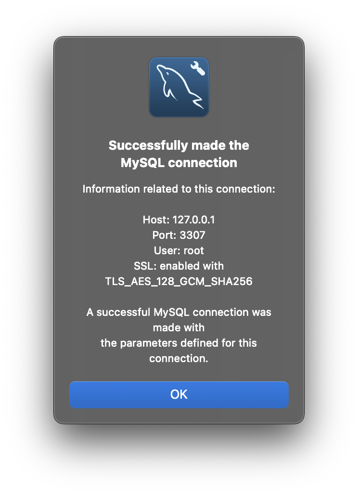
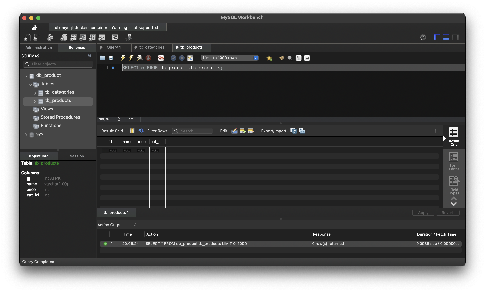
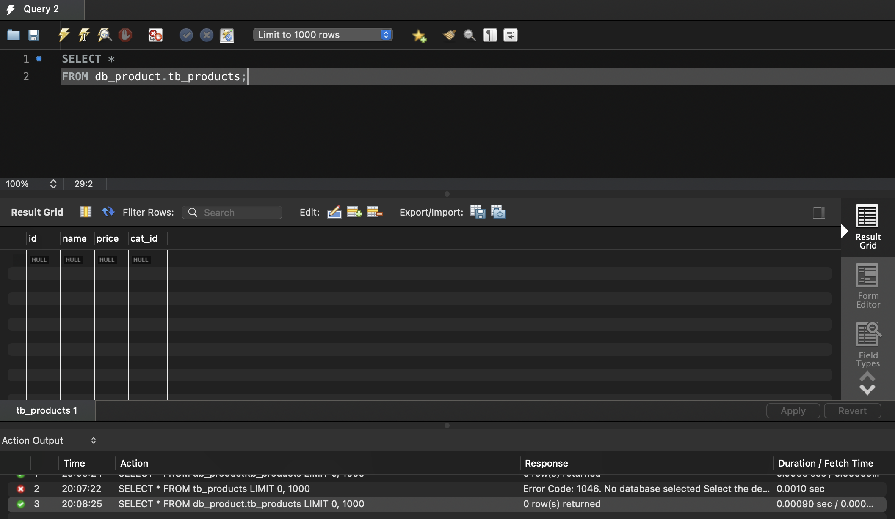
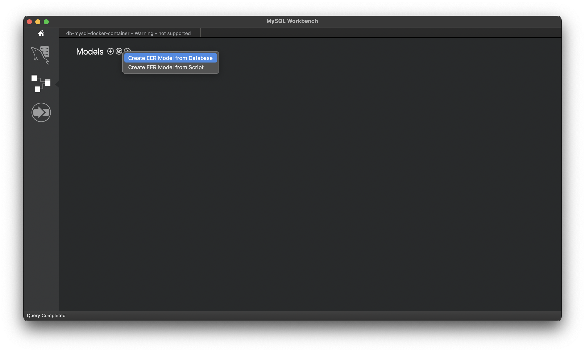
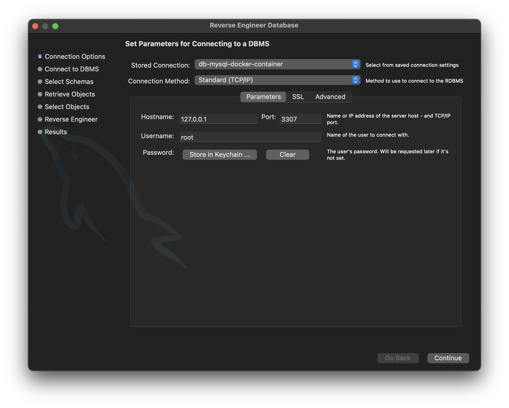
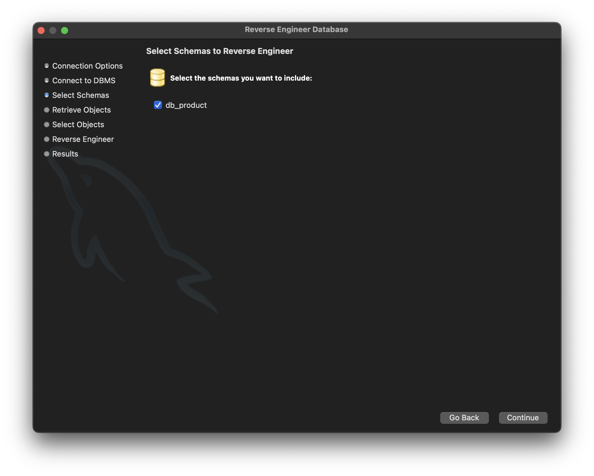
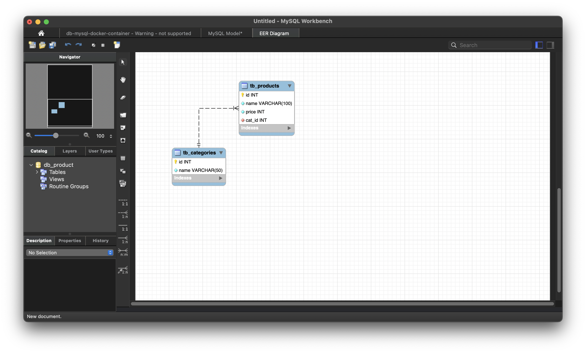

# Lab03 - Create and Access database on MySQL Docker Container

References: 
* https://dev.mysql.com/doc/refman/8.4/en/creating-database.html
* https://phoenixnap.com/kb/how-to-create-a-table-in-mysql 

## Step 1 

Install Client GUI Tool to access Database

* MySQL Workbench: https://dev.mysql.com/downloads/workbench/
* Azure Data Studio: https://azure.microsoft.com/en-us/products/data-studio
    *   Install Extension:
        * MySQL
        * SQL Database project

## Step 2

Connect to Database with Terminal

### Step 2.1

Start MySQL Docker Container

```shell
docker container start db-mysql
```

Check status of MySQL Docker Container

```shell
docker ps
```

### Step 2.2

Access to MySQL Docker Container

```shell
docker exec -it db-mysql bash
```

### Step 2.3

Connect to Database on MySQL Docker Container

```shell
mysql -u db_user -p
```

using db_user password is ***user_pass***

## Step 3

* Create database with syntax command 

```sql
CREATE {DATABASE | SCHEMA} [IF NOT EXISTS] db_name
    [create_option] ...

create_option: [DEFAULT] {
    CHARACTER SET [=] charset_name
  | COLLATE [=] collation_name
  | ENCRYPTION [=] {'Y' | 'N'}
}
```

* And now, we create database ***db-product*** with command

```sql
CREATE DATABASE IF NOT EXISTS db_product
CHARACTER SET utf16
COLLATE utf16_unicode_ci;
```

* Select database to access

```sql
use db_product;
```

* Show current database which is using

```sql
SELECT DATABASE();
```

* And drop database with command

```sql
DROP DATABASE db_product;
```

* Show all database tin MySQL Server

```sql
SHOW DATABASES;
```

## Step 4

Create new tables with foreign key

* Set default storage engine for current section

```sql
SET default_storage_engine = InnoDB;
```

* Create ***tb_categories*** table

```sql
CREATE TABLE IF NOT EXISTS tb_categories (
    id INT AUTO_INCREMENT PRIMARY KEY NOT NULL,
    name VARCHAR(50) NOT NULL
) CHARACTER SET utf16 COLLATE utf16_unicode_ci ENGINE=InnoDB;
```

or

```sql
CREATE TABLE IF NOT EXISTS tb_categories (
    id INT AUTO_INCREMENT NOT NULL,
    name VARCHAR(50) NOT NULL,
    PRIMARY KEY (id)
) CHARACTER SET utf16 COLLATE utf16_unicode_ci ENGINE=InnoDB;
```

* Create ***tb_products*** table have foreign key to reference to id of tb_categories

```sql
CREATE TABLE IF NOT EXISTS tb_products (
    id INT AUTO_INCREMENT NOT NULL,
    name VARCHAR(100) NOT NULL, 
    price INT NOT NULL,
    cat_id INT NOT NULL, 
    PRIMARY KEY (id),
    FOREIGN KEY (cat_id) 
        REFERENCES tb_categories(id) 
        ON UPDATE CASCADE 
        ON DELETE RESTRICT
) CHARACTER SET utf16 COLLATE utf16_unicode_ci ENGINE=InnoDB;
```

* Show all table on database

```sql
SHOW TABLES;
```

* Using __DESCRIBE__ command to show table structure

```sql
DESCRIBE tb_categories;
```

and 

```sql
DESCRIBE tb_products;
```

## Step 5

Using GUI Client tool to access to MySQL Docker Container database

### 5.1 - MySQL Workbench

Download MySQL Workbench: [click here to download](https://dev.mysql.com/downloads/workbench/)



* Create Connect to Database with MySQL Workbench



click to button ***Test connection*** to test



Click to button ***OK*** to save the connection

* Connect to database (database schema db_product)

Click connection which is created in above step to connect the database



* Using MySQL Work to access database (database schema db_product)

Create query to access database



* Create EER model (Database Diagram) with MySQL Workbench

Create EER model from Database



Using connection which is create to connect the database



Click ***Continue*** button to move to next step

Chose Database to create EER Model



Click ***Continue*** button to end step

***The EER is the same as below picture***

