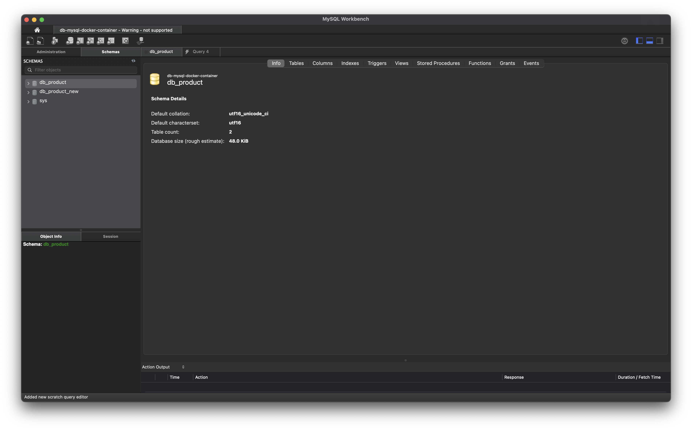
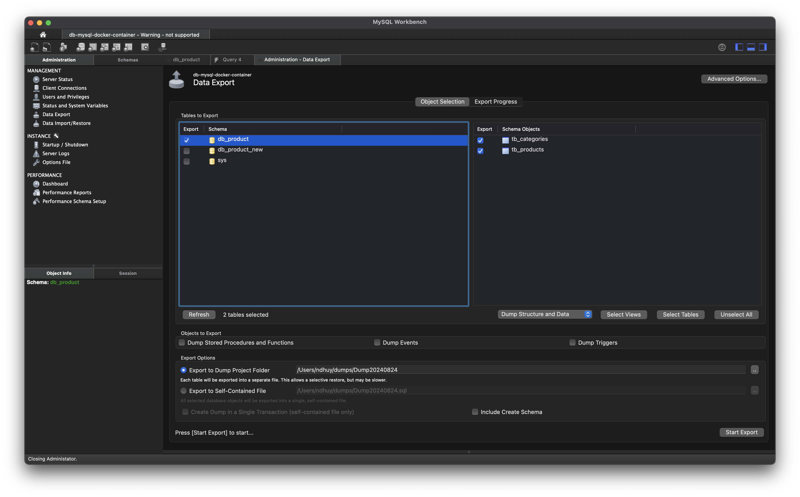
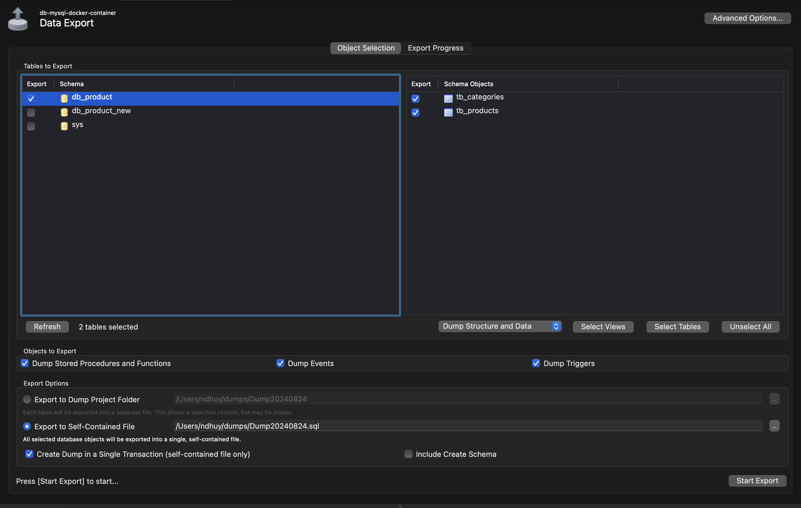
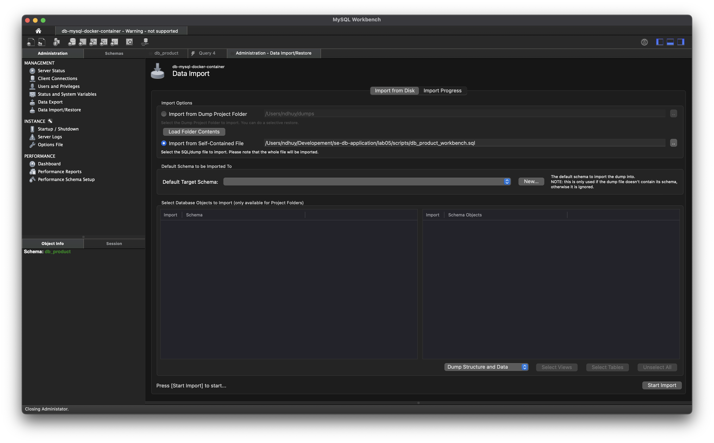

# Export and Import Data

## 1 - Using terminal

### 1.1 - Export database

* Connect to MySQL Docker Container

```shell
docker exec -it db_product bash
```

* Navigate to directory ***/var/lib/mysql*** (because docker volume is mapped here)

```shell
cd /var/lib/mysql
```

* Dump database to Script SQL file with name db_product_script.sql

```shell
mysqldump -u root -p db_product > db_product_script.sql
```

* Copy script file ***db_product_script.sql*** from docker volume or docker container ***db-mysql-new-data*** to host (PC)

```shell
docker cp db-mysql:/var/lib/mysql/db_product_script.sql ./scripts/db_product_script.sql
```

### 1.2 - Import database

* Duplicate script file db_product_script.sql to db_product_new.sql

* Copy file ***db_product_new.sql*** to Docker Volume (MySQL Docker Container) ***/var/lib/mysql/***

```shell
docker cp ./script/db_product_new.sql db-mysql:/var/lib/mysql/
```

* In MySQL Docker Container, ***CREATE DATABASE*** with database name ***db_product_new***

```sql
CREATE DATABASE IF NOT EXISTS `db_product_new`
CHARACTER SET utf16
COLLATE utf16_unicode_ci;
```
* In MySQL Docker Container, execute ***db_product_new.sql*** to immport data to database ***db_product_new***

```shell
mysql -u root -p db_product_new < ./var/lib/mysql/db_product_new.sql
```

* Connect to database to check data after import

```shell
mysql -u root -p
```
imput root password (*admin123*)

* Show all database

```sql
SHOW DATABASES;
```

* Set ***db_product_new*** is current working database

```sql
use db_product_new;
```

* Show all tables in database ***db_product_new***

```sql
SHOW TABLES;
```

* Execute query to check data

```sql
SELECT p.id, p.name, p.price, c.name
FROM tb_products p LEFT JOIN tb_categories c ON p.cat_id = c.id;
```

## 2 - Using GUI Tool - MySQL Workbench

#### 2.1 - Export database with MySQL Workbench

* Connect to MySQL Docker Container with MySQL Workbench



* In MySQL Workbench, in the ***Administrator*** panel, select ***Data export***



* In right panel of ***Administration Data Export***, choose database ***db_product*** and specification tables/all database, dump ***Store Procedure/Trigger/Function*** and ***Data***. After that, choose host location to store SQL script file which is exported.



> Edit SQL script file because the script contain special code which is used define DELIMITER to create function
> * Change name of database in script
> ```sql
> CREATE DATABASE  IF NOT EXISTS `db_product_workbench` /*!40100 DEFAULT CHARACTER SET utf16 COLLATE utf16_unicode_ci */ /*!80016 DEFAULT ENCRYPTION='N' */;
> USE `db_product_workbench`;
> ```
> * Add the SQL command before the line to create ***DELIMITER;;***
> ```sql
> SET GLOBAL log_bin_trust_function_creators = 1;
> ```

#### 2.2 - Import database with MySQL Workbench

* In MySQL Workbench, in the ***Administrator*** panel, choose ***Data Import/Restore***.

* Specific database to import



> ***Azure Data Studio*** only export and import database for ***MS SQL Server***