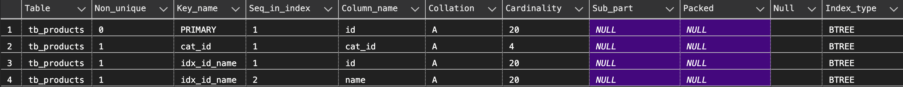
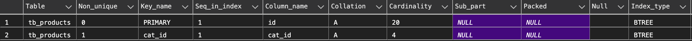

# Index data in MySQL

Using database ***db_products*** for lab

## 1 - Create INDEX syntax

* Syntax

```sql
CREATE INDEX index_name
ON table_name (column1, column2, ...);
```

* Example: create index for column ***id*** and ***name*** of table ***tb_products***

```sql
CREATE INDEX idx_id_name ON tb_products (id, name);
```

## 2 - Show INDEX on table

* Show list of INDEXs on table ***tb_products***

```sql
SHOW INDEX FROM tb_products;
```




## 3 - Drop INDEX on table

* Drop INDEX have name ***idx_id_name*** on table ***tb_products***

```sql
DROP INDEX idx_id_name ON tb_products;
```

* After that, show all INDEXs on table ***tb_products***

```sql
SHOW INDEX FROM tb_products;
```


