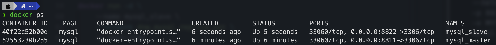

# Replica set in MySQL

using database ***db_product***

Reference:

* Setup with Linux Server: [https://phoenixnap.com/kb/mysql-master-slave-replication](https://phoenixnap.com/kb/mysql-master-slave-replication)

* Setup with MySQL Docker Container: [https://www.linkedin.com/pulse/mysql-master-slave-replication-setup-docker-trong-luong-van-5wbxc/](https://www.linkedin.com/pulse/mysql-master-slave-replication-setup-docker-trong-luong-van-5wbxc/)

## 1 - Method 01 - Setup replica set for MySQL Docker Container

* follow reference [https://www.linkedin.com/pulse/mysql-master-slave-replication-setup-docker-trong-luong-van-5wbxc/](https://www.linkedin.com/pulse/mysql-master-slave-replication-setup-docker-trong-luong-van-5wbxc/)

### 1.1 - Step 01 - Prerequisites

* Create docker network with name ***dnw_mysql_replica_set***

```shell
docker network create  dnw_mysql_replica_set
```

* Check docker network to confirm

```shell
docker network ls
```

* Run MySQL MASTER docker container

Check DOCKER IMAGE mysql

```shell
docker image ls
```

Create and Run docker container for MySQL MASTER with information:
> Docker container name: ***mysql_master*** \
> Docker container port mapping: ***8811:3306*** \
> Docker MySQL Root user password: ***admin123***

```shell
docker run -d \
    --name mysql_master \
    --network dnw_mysql_replica_set \
    -p 8811:3306
    -e MYSQL_ROOT_PASSWORD='admin123'
    mysql
```

* Run MySQL SLAVE  docker container

Create and Run docker container for MySQL SLAVE with information:
> Docker container name: ***mysql_slave*** \
> Docker container port mapping: ***8822:3306*** \
> Docker MySQL Root user password: ***admin123***

```shell
docker run -d \
    --name mysql_slave \
    --network dnw_mysql_replica_set \
    -p 8822:3306
    -e MYSQL_ROOT_PASSWORD='admin123'
    mysql
```

* check docker container running



### 1.2 - Step 02 - Config Master-Slave replication

* Accessing container configuration files

*copy files my.cnf from master and slave mysql docker container to real folder ./lab10/mysql*

```shell
docker cp mysql_master:/etc/my.cnf ./lab10/mysql/mater
docker cp mysql_slave:/etc/my.cnf ./lab10/mysql/slave
```

* Edit configuration files

Update configure to ***./lab10/mysql/mater***

```lua
log_bin=mysql-bin
server-id=1
```

Update configure to ***./lab10/mysql/slave***

```lua
log_bin=mysql-bin
server-id=2
```

* Copy configuration files to MySQL docker containers

```shell
docker cp ./lab10/mysql/master mysql_master:/etc/my.cnf
docker cp ./lab10/mysql/slave mysql_slave:/etc/my.cnf
```

* Restart 2 MySQL Docker Container

```shell
docker restart mysql_master
docker restart mysql_slave
```

* Get information about the MASTER replication setup

> Login with ROOT user to MySQL Docker Container

```shell
docker exec -it mysql_master bash
mysql -u root -p
```

*Enter root_password = 'admin123"*

> Run SQL Command to get Master Status


```sql
-- using for MySQL version 8.0 and before
SHOW MASTER STATUS;

-- using for MySQL version 9.0 and after
SHOW BINARY LOG STATUS;
```


> File: mysql-bin.000001 \
> Position: 158

Inspect information of Master Container

```shell
docker inspect mysql_master
```
And get IP Address of Master Container

```json
 "IPAddress": "172.18.0.2"
```

* Configuring Slave Replication

Access Slave Container with MySQL CLI

```shell
docker exec -it mysql_slave bash
mysql -u root -p
```

*Enter root_password = 'admin123"*

Execute command to configure ***Slave Replication*** setting

```sql
--- using for MySQL 8.0 and before
CHANGE MASTER TO
    MASTER_HOST='172.18.0.2',
    MASTER_PORT=3306,
    MASTER_USER='root',
    MASTER_PASSWORD='admin123',
    MASTER_LOG_FILE='mysql-bin.000001',
    MASTER_LOG_POS=158,
    MASTER_CONNECT_RETRY=60,
    GET_MASTER_PUBLIC_KEY=1;

--- using for MySQL 9.0 and after
CHANGE REPLICATION SOURCE TO
    SOURCE_HOST='172.18.0.2',
    SOURCE_PORT=3306,
    SOURCE_USER='root',
    SOURCE_PASSWORD='admin123',
    SOURCE_LOG_FILE='mysql-bin.000001',
    SOURCE_LOG_POS=158,
    SOURCE_CONNECT_RETRY=60,
    GET_SOURCE_PUBLIC_KEY=1; 
```

Restart Replication in SLAVE

```sql
--- using for MySQL 8.0 and before
START SLAVE;

--- using for MySQL 9.0 and after
START REPLICA;
```

After configuring, verify status by MySQL CLI

```sql
--- using for MySQL 8.0 and before
SHOW SLAVE STATUS\G;

--- using for MySQL 9.0 and after
SHOW REPLICA STATUS\G;
```

We check and confirm:
> Version MySQL 8.0
>> ***Slave_IO_Running: Yes*** \
>> ***Slave_SQL_Running: Yes*** 

> Version MySQL 9.0
>> ***Replica_IO_Running: Yes*** \
>> ***Replica_SQL_Running: Yes***

* Verifying Replication setup

Create Database ***users*** on ***Master*** Replication

```sql
--- create users database
CREATE DATABASE users default charset utf8mb4;

--- show all databases
SHOW DATABASES;
```

After that, access to Slave database and check all databases

```sql
SHOW DATABASES;
```

If we see ***users*** database exist in both Master and Slave, I done