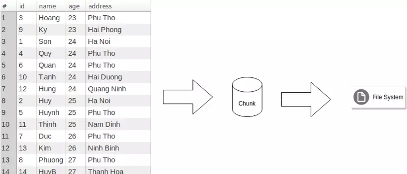
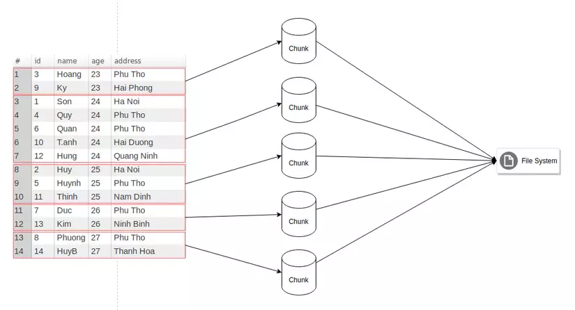
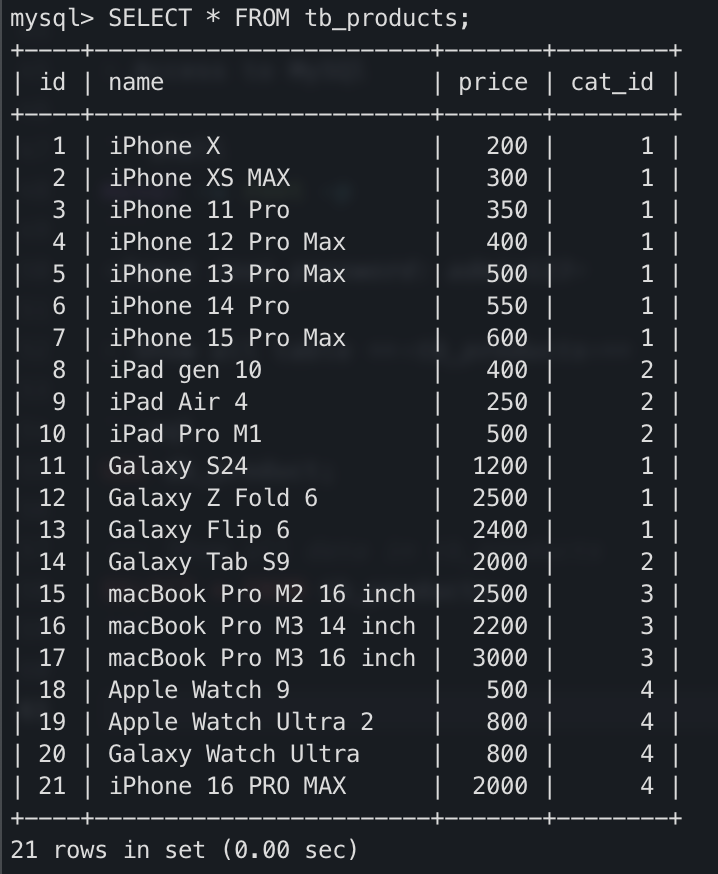
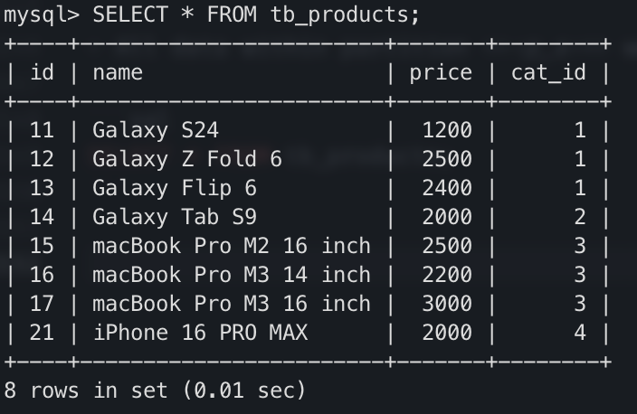

# Partition in MySQL

using ***db_product*** database for this lab

## 1. Introduce partition

* Before partition



* After partition



* Type of partition
 
> Range partition

```sql
mysql> CREATE TABLE sales (no INT NOT NULL, date TIMESTAMP NOT NULL, 
code VARCHAR(15) NOT NULL, amount INT NOT NULL) 
PARTITION  BY RANGE (amount) (
PARTITION p0 VALUES LESS THAN (100), 
PARTITION  p1 VALUES LESS THAN (300), 
PARTITION p2 VALUES LESS THAN (700), 
PARTITION  p3 VALUES LESS THAN (1000)); 
Query OK, 0 rows affected (1.34 sec)
```

> List partition

```sql
mysql> CREATE TABLE sales (no INT NOT NULL, date TIMESTAMP NOT NULL, 
code VARCHAR(15) NOT NULL, amount INT NOT NULL, saler_id INT NOT NULL) 
PARTITION  BY LIST(saler_id) (
PARTITION pA VALUES IN (1,2,5), 
PARTITION pB VALUES IN (3,4,8), 
PARTITION pC VALUES IN (6,7,9,10)); 
Query OK, 0 rows affected (1.34 sec)
```

> Column partition

> Hash partition

> Key partition

> Subpartition

## 2. Create partition

* Syntax to create partition

```sql
CREATE [TEMPORARY] TABLE [IF NOT EXISTS] tbl_name
(create_definition,...)
[table_options]
[partition_options]
```
or

```sql
ALTER TABLE tbl_name [partition_options]
```

* Now, step by step to create partition for ***db_product***

> Start MySQL Docker Container

```shell
docker start db-mysql
```

> Access to docker container

```shell
docker exec -it db-mysql bash
```

> Access to MySQl

```shell
mysql -u root -p
```
*Input root password: admin123*

> Show all table ***tb_products***

```sql
USE db_product;

--- Show all data in tb_products
SELECT * FROM tb_products;
```



> We cannot create partition for table have foreign key. So we need drop foreign key before create partition

```sql
--- get foreign key name
SHOW CREATE TABLE tb_products;

--- dop foreign key with name tb_products_ibfk_1
ALTER TABLE tb_products
DROP FOREIGN KEY tb_products_ibfk_1;
```

> Create 02 partition for Range of Price

```sql
ALTER TABLE tb_products
    DROP PRIMARY KEY,
    ADD PRIMARY KEY (id, price)
    PARTITION BY RANGE(price)(
        PARTITION p_a VALUES LESS THAN (1000),
        PARTITION p_b VALUES LESS THAN MAXVALUE
    );
```

> Show all partition on table

```sql
SELECT PARTITION_NAME, TABLE_ROWS FROM INFORMATION_SCHEMA.PARTITIONS WHERE TABLE_NAME='tb_products';
```

> Select data for common SELECT CLI

```sql
SELECT * FROM tb_products;
SELECT * FROM tb_products WHERE price < 1000;
```

## 3. Drop partition

* Syntax

```sql
ALTER TABLE <table_name> TRUNCATE PARTITION <partitioin_name>;
```

```sql
ALTER TABLE tb_products TRUNCATE PARTITION p_a;
```

* All data within partition ***p_a*** will be lost

```sql
SELECT * FROM tb_products;
```

